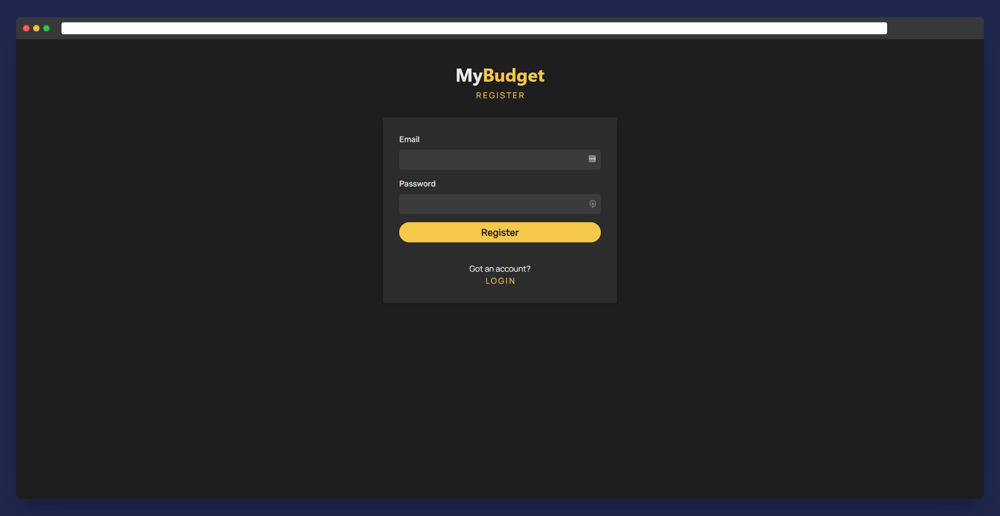
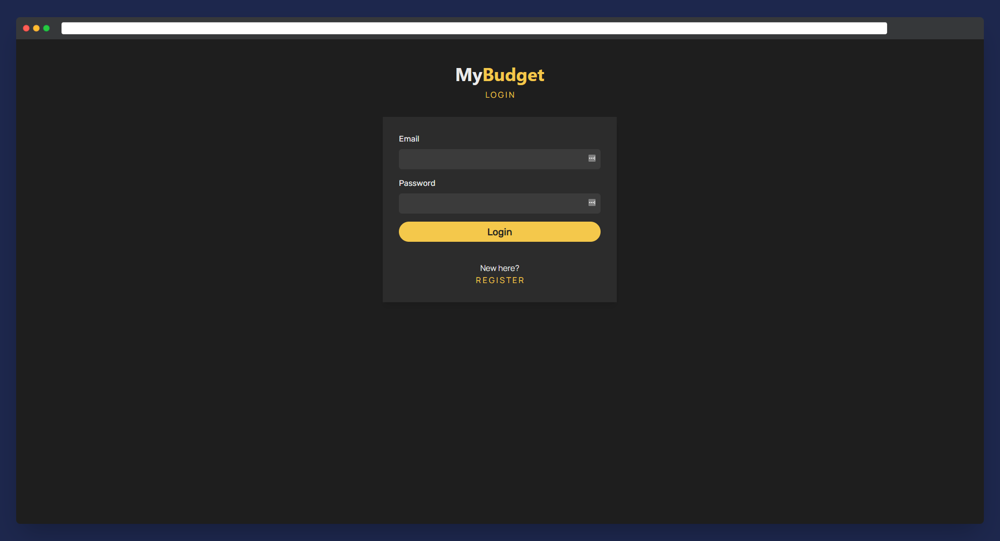
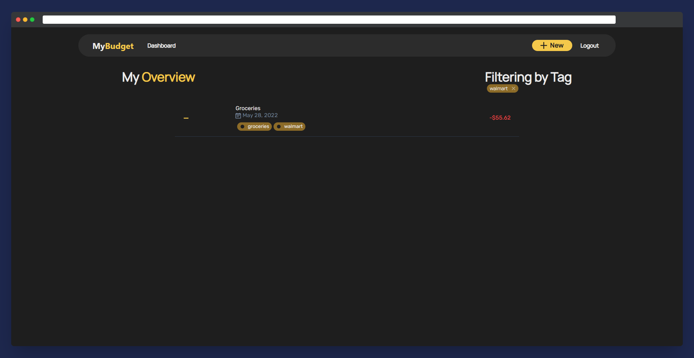
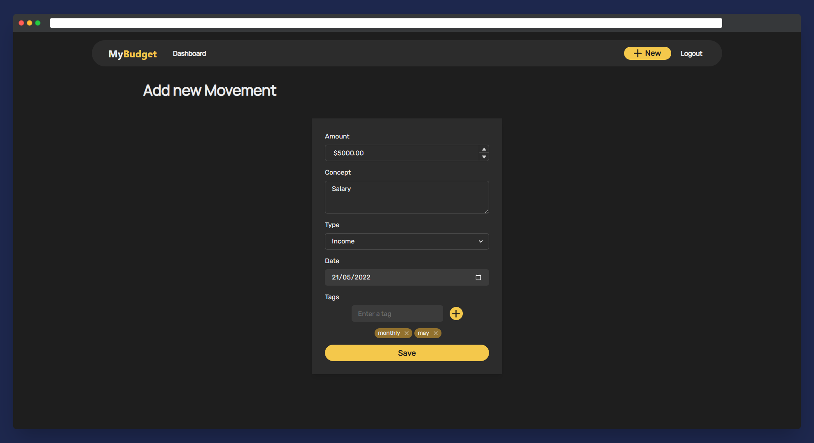
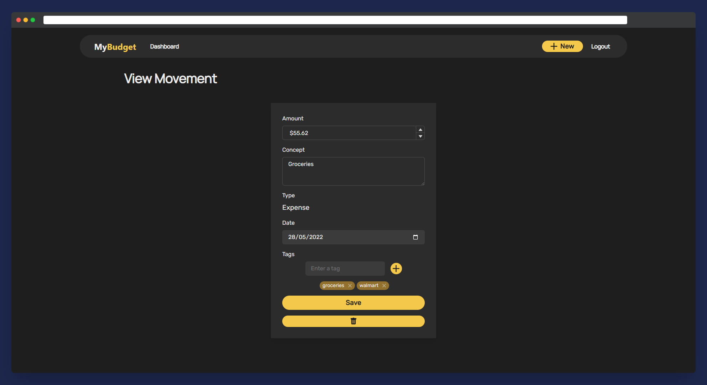
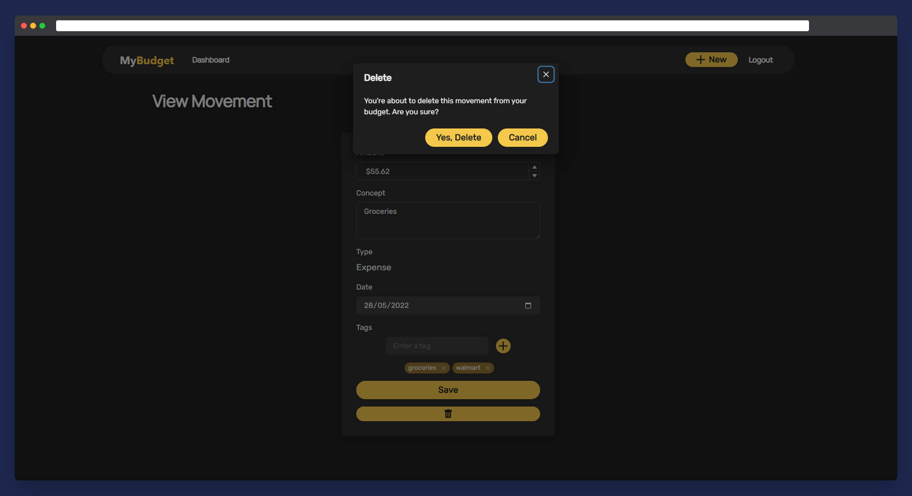

# My Budget app
TL;DR: [Production version / Example](https://my-budget-nu.vercel.app/)

[Spanish ahead]

# Results - MyBudget
MyBudget is the name I decided to give to this small app I designed.
We can easily separate it in two sides, client (front end) and api (back end).

## Client (Front End)
The Front End has been designed using the following frameworks and libreries:
* ReactJS
* ChakraUI (for styling)
* React-form-hooks
* react-route-dom
* React-query

* ChakraUI is currently my go-to components lib for design, as it includes a lot of useful resources and needs minimal configuration. 
For this design, I went with a really simple color palette and minimalistic styles for the components, as I had not too much time to spare, got it done pretty quickly.
* Forms validation is hanlded by form hooks - could be done totally from scratch but this way is always easier.

* React-query along with axios to connect the back to the front, as it includes many hooks to refresh the state and handle errors, comes really handy.

### Pages
 
 * Register
 

  
Register

 

 * Login
  

  
login

 

* Home/Overview
 

  
Home/Overview

 

 * List filtering by tag

  
Filter

 

* New movement
 

  
New movement

 

* View/Edit movement (and delete function)

 

  
View/edit

 
  

## API (Back End)
The backend is built on top of:
* ExpressJS
* Passport (for JWT authentication)
* Sequelize (RDMS used: Postgre)

### Endpoints
| Endpoint      | Parameter(s) | Description |
| ----------- | ----------- | -----------|
| GET `/`           |  none      |version |
| POST `/auth/login`   | `username`, `password `      | If sucessful, returns user info along with JWT |
| POST `/auth/register`   | `username`, `password `      | If sucessful, returns user info along with JWT |
| GET `/auth/me`           |  `[Auth needed]` none      |returns session information |
| GET `/movement`   |  `[Auth needed]`  optional: object with tags filter |returns movement list if logged in. |
| POST `/movement`   |  `[Auth needed]`  concept, amount, type, tags |returns new movement |
| PATCH `/movement/:id`   | `[Auth needed]` concept, amount,  tags |returns movement |
| DELETE `/movement/:id`   |  `[Auth needed]`  none |returns true/false |

## Deployment
Front end is currently deployed [on Vercel HERE](https://my-budget-nu.vercel.app/), API is deployed on Heroku.

### How to deploy locally

You can easily deploy it by cloning this repository.
*  **Deploy client:**
Run `yarn start` or for production make a build `yarn build` and serve it statically.

*  **Deploy API:**
Run `node ./build/server.js`. API is already built using Babel, to make any change go to `src` folder and then build it again with babel-cli.
