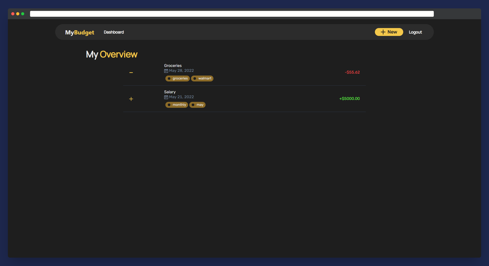

# Alkemy Full Stack JS Challenge
TL;DR: [Production version / Example](https://my-budget-nu.vercel.app/)

[Spanish ahead]
# Consigna

## Objetivo

Desarrollar una aplicación para administración de presupuesto personal. La misma debe
permitir crear y editar ingresos y egresos de dinero, y mostrar un balance resultante de las
operaciones registradas.

## Requerimientos Técnicos
Deberás desarrollar una API en Node.js junto a cualquiera de los siguientes frameworks,
en sus versiones estables:

* Express
* Adonis
* Koa

En el caso de querer utilizar otro framework es posible, pero debe consultarse con
anterioridad.

Los datos mostrados deben ser persistidos en una base de datos relacional. El esquema de
datos puede armarse según se considere apropiado en base a los requerimientos del
negocio. La API deberá exponer URLS que devuelvan datos en JSON.
Estos datos en JSON deberán ser consumidos por un cliente, a través de peticiones AJAX.
El cliente puede ser armado con React.js.
El trabajo realizado se subirá a un repositorio.

## Secciones

### Home
La pantalla de inicio deberá mostrar el balance actual, es decir, el resultante de los
ingresos y egresos de dinero cargados, y un listado de los últimos 10 registrados.

### ABM de operaciones (ingresos y egresos)
La aplicación deberá contener:
* Formulario de registro de operación. El mismo deberá contener:
** Concepto
** Monto
** Fecha
** Tipo (ingreso o egreso)
* Listado de operaciones registradas según su tipo (ingreso o egreso).
* Desde el listado, se debe poder modificar o eliminar una operación registrada
previamente. No debe ser posible modificar el tipo de operación (ingreso o
egreso) una vez creada.
## Bonus
De forma adicional, puede
* Autenticación de usuarios
* Agregar un formulario de registro y login para permitir identificar al usuario que utiliza la
aplicación, y vincular las operaciones registradas al usuario autenticado en el sistema,
tanto para el listado y creación de nuevos registros. Los datos indispensables para permitir
el ingreso deben ser un email y contraseña, pudiendo agregar los que se deseen.
* Categorías de operaciones
* Agregar la funcionalidad de categorizar las operaciones registradas en el gestor, como por
ejemplo, una categoría “comida” para categorizar egresos. * Adicionalmente, agregar la
posibilidad de listar operaciones por categoría.

## Criterios a Evaluar
* El diseño debe ser responsive, pudiendo utilizarse CSS puro o algún framework
de Frontend
* Código limpio, buenas prácticas de programación, en idioma inglés

* Correcto diseño de la base de datos
* Buenas prácticas de GIT: Commits declarativos y atomizados
* Buenas prácticas para el nombre de rutas 

# Results - MyBudget
MyBudget is the name I decided to give to this small app I designed.
We can easily separate it in two sides, client (front end) and api (back end).

## Client (Front End)
The Front End has been designed using the following frameworks and libreries:
* ReactJS
* ChakraUI (for styling)
* React-form-hooks
* react-route-dom
* React-query

* ChakraUI is currently my go-to components lib for design, as it includes a lot of useful resources and needs minimal configuration. 
For this design, I went with a really simple color palette and minimalistic styles for the components, as I had not too much time to spare, got it done pretty quickly.
* Forms validation is hanlded by form hooks - could be done totally from scratch but this way is always easier.

* React-query along with axios to connect the back to the front, as it includes many hooks to refresh the state and handle errors, comes really handy.

### Pages
 
 * Register
 

  
Register

 

 * Login
  

  
login

 

* Home/Overview
 

  
Home/Overview

 

 * List filtering by tag

  
Filter

 

* New movement
 

  
New movement

 

* View/Edit movement (and delete function)

 

  
View/edit

 
  

## API (Back End)
The backend is built on top of:
* ExpressJS
* Passport (for JWT authentication)
* Sequelize (RDMS used: Postgre)

### Endpoints
| Endpoint      | Parameter(s) | Description |
| ----------- | ----------- | -----------|
| GET `/`           |  none      |version |
| POST `/auth/login`   | `username`, `password `      | If sucessful, returns user info along with JWT |
| POST `/auth/register`   | `username`, `password `      | If sucessful, returns user info along with JWT |
| GET `/auth/me`           |  `[Auth needed]` none      |returns session information |
| GET `/movement`   |  `[Auth needed]`  optional: object with tags filter |returns movement list if logged in. |
| POST `/movement`   |  `[Auth needed]`  concept, amount, type, tags |returns new movement |
| PATCH `/movement/:id`   | `[Auth needed]` concept, amount,  tags |returns movement |
| DELETE `/movement/:id`   |  `[Auth needed]`  none |returns true/false |

## Deployment
Front end is currently deployed [on Vercel HERE](https://my-budget-nu.vercel.app/), API is deployed on Heroku.

### How to deploy locally

You can easily deploy it by cloning this repository.
*  **Deploy client:**
Run `yarn start` or for production make a build `yarn build` and serve it statically.

*  **Deploy API:**
Run `node ./build/server.js`. API is already built using Babel, to make any change go to `src` folder and then build it again with babel-cli.